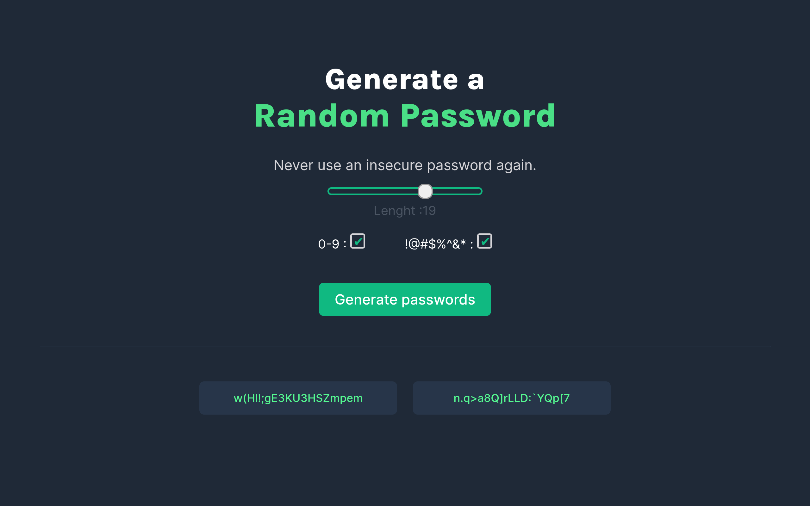

# Generate a Random Password



## What?

Never use an insecure password again, Generate a Random Password up to a character length of 25 char, by combining lower, upper case, special symbol and number.

Quick start:

```
$ npm install
$ npm start
````
